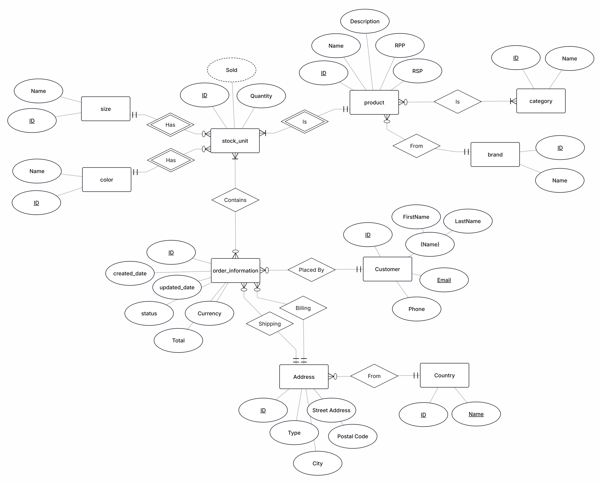
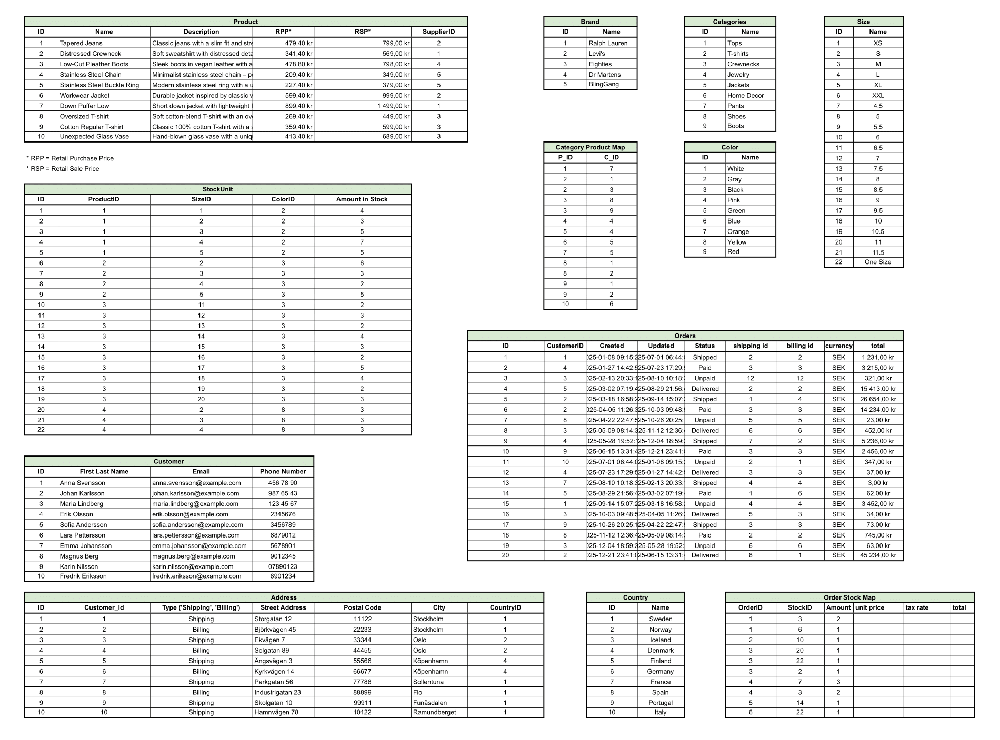

# webShopDB
This is an assignment to prove our understanding of creating databases and how to create queries based on demanded requirements.
The code is not fit for production and is only used as base for grading.

## Functionalities
These are limited to only showing specific information required by the assignment, further functionality will be explored
in a future project using Spring Boot and Hibernate instead.

### 1. Order Information
Displays the order information with:
`ID | NAME | STATUS | TOTALT`

Which can be filtered based on the text entry in these fields: `Order Id | Customer Id | Category | Size | Color`

The user have the opportunity to enter text in several fields to create a more complex query.

### 2. Stock Information
Displays information about stock_units with:
`ID | NAME | COLOR | SIZE | BRAND | QTY | SOLD`

The user can choose to either:
* Rank by best-selling products. Where the products are presented in descending order based on most sold in quantity.
* Show categories. Shows the specific categories of the web shop and how many products every category has.

### 3. Customer Information
Displays the customer information with:
`ID | NAME | EMAIL | PHONE | QTY | TOTAL`

The user can choose to either:
* Filter on the frequent buyers. The customers will then be presented in order of how many orders they have placed.
* Sort newest. Will display the customers from the newest to oldest.

## Resources
These are the documents I've used for planning my database:

### 1. ER-Model

### 2. Relations-Model
